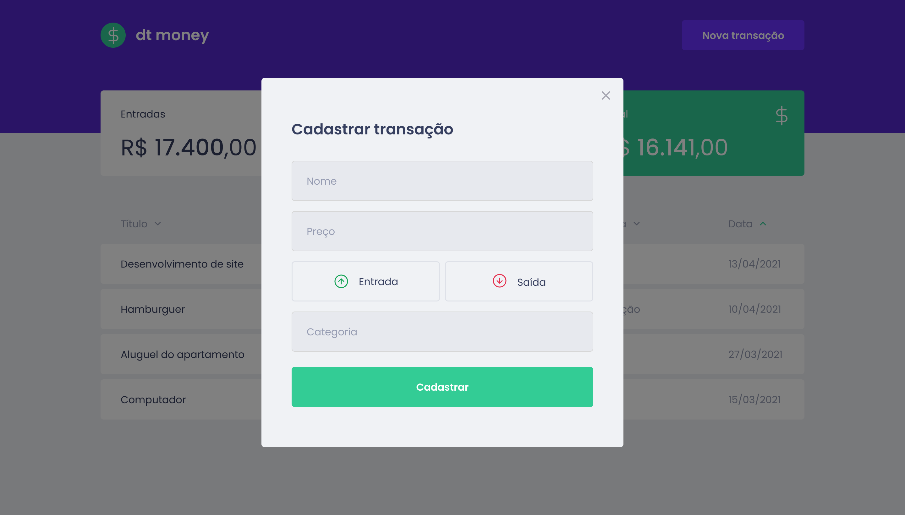

# 

<br>


<p align="center">
  
</p>

<p align="center">
  
</p>

<hr>

## 📖 Sobre

Aplicação desenvolvida com o intuito de ajudar o usuário a gerenciar suas finanças de forma clara e objetiva. DTMoney permite que o usuário cadastre suas transações financeiras de entrada e saída, e lista todas as transações.

## 💻 Tecnologias

- [React](https://pt-br.reactjs.org/)
- [TypeScript](https://www.typescriptlang.org/)
- [MirageJS](https://miragejs.com/)
- [Polished](https://polished.js.org/)
- [Axios](https://github.com/axios/axios)
- [Styled Componensts](https://styled-components.com/)

## ✔ Pré-Requisitos

Antes de começar 🏁, você precisa ter o [Git](https://git-scm.com) e o [Node](https://nodejs.org/en/) instalados em sua máquina.

## Rodando aplicação

```bash
# Clone o repositório: 
$ git clone https://github.com/2joliveira/dtmoney

# Acesse a pasta dtmoney:
$ cd dtmoney

# Instale as dependências do projeto:
$ yarn

# Execute a aplicação:
$ yarn start
```

🕹🚀